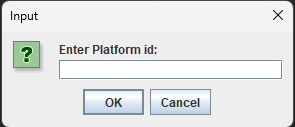
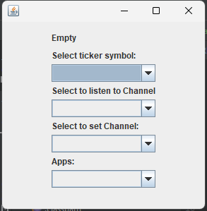
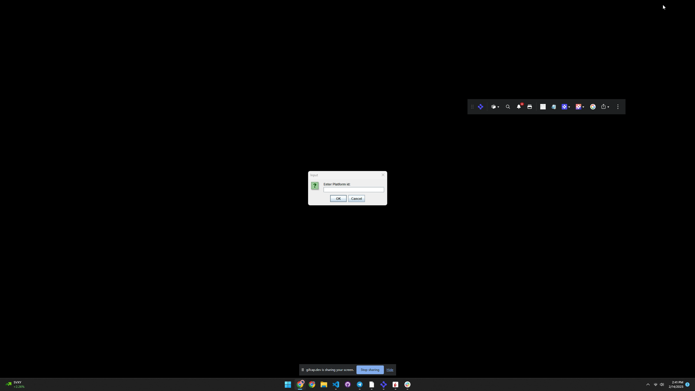

# How To - Integrate with Workspace

An example of interop with native applications and a workspace platform.

This example connects three native applications to a workspace platform. The implementation of the workspace platform is on our workspace starter repo: <https://github.com/built-on-openfin/workspace-starter/tree/main/how-to/customize-workspace>.

It shows how a native application and a workspace platform could work together so that the native applications could provide a list of apps to a platform and provide information so that the native application can be part of a saved workspace.

## Launch Steps:
Launch customize-workspace from the workspace-starter repo. This will launch the workspace platform and the native applications.

Start Java-Starter from this repo. This will launch the Java application and connect to the workspace platform.

Enter 'customize-workspace' into the Platform id prompt and hit enter. This will connect the Java application to the workspace platform (The platform id can be found in the manifest of the starter project.

The launched application will allow you to launch native windows and listen/transmit context(ticker symbols) to the workspace platform.

## Context Sharing:

## Register native apps with workspace:

## Save native apps in workspace:

Capabilities:

* Ctrl + Space will bring up the Home UI.
* You can filter using text or using the tags filter
* Hitting enter launches the selected app
* typing /store will let you launch the store which will let you browse your available applications.

You can save a workspace by using the workspace menu in the OpenFin Workspace Browser or you can type the following into home /w myworkspace.

The Native applications connect to a specific channel api exposed by the workspace platform. This is configured in the workspace platform's manifest file and defined in the App.config files of the native applications. 