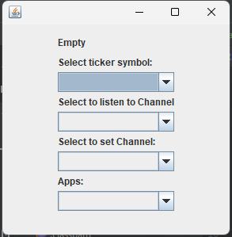
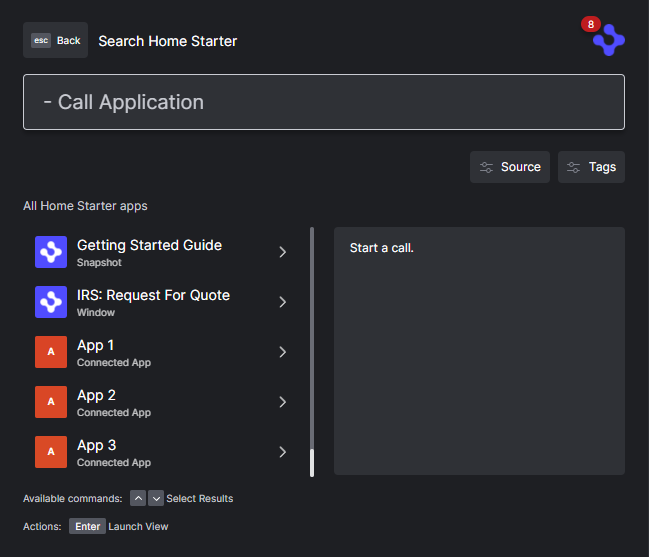

# How to Interop with a Workspace Platform

This example connects three native applications to a workspace platform. The implementation of the workspace platform is on our workspace starter repo: <https://github.com/built-on-openfin/workspace-starter/tree/main/how-to/customize-workspace>.

It shows how a native application and a workspace platform could work together so that the native applications could provide a list of apps to a platform and provide information so that the native application can be part of a saved workspace.

## Launch Steps:
- Launch customize-workspace from the workspace-starter repo. This will launch the workspace platform and the native applications.

- Start Java-Starter from this repo. This will launch the Java application and connect to the workspace platform.

- Enter 'customize-workspace' into the Platform id prompt. This will connect the Java application to the workspace platform (The platform id can be found in the manifest of the starter project)

The launched application will allow you to launch native windows and listen/transmit context(ticker symbols) to the workspace platform.

## Native App Integration from Home:

- Customize-workspace starter queries java project for native apps. The java project responds with a list launchable of native apps.

### Customize Workspace Query for Native Apps (connections.ts in customize-workspace repo):
    
    export async function getConnectedApps(): Promise<PlatformApp[]> {

### Customize Workspace Launch Native Apps (connections.ts in customize-workspace repo):

    export async function launchConnectedApp(app: PlatformApp) {

### Java Project Responds with Native Apps (InteropTest.java):

    client.register("getApps", (action, payload, senderIdentity) -> {

### Java Project Launches Native App (InteropTest.java):

    client.register("launchApp", (action, payload, senderIdentity) -> {
